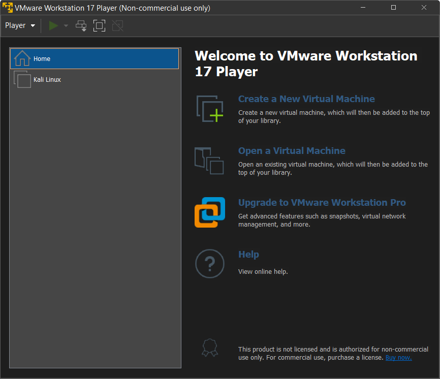

# Z3R0D4Y Custom VMWare Hackbox Installation Guide

Hackbox, a machine dedicated to pentesting. It's a good idea to isolate your pentesting environment from your private PC. We provide two custom VMWare images that has minor changes. Our changes to the original ISO:

- Default Desktop Wallpaper
- Default keyboard changed to danish windows keyboard
- Time changed to match the danish timezone

If you find yourself downloading tools that is often used in CTF's but not installed by default, let us know and then we will add it to our kali image.

This guide will walk you through a VMWare VM installation. If you don't already have WMWare installed, you can [install it from here for free](https://www.vmware.com/products/workstation-player.html).

## Choose an OS

The two most used hackbox operating systems are Kali Linux and Parrot OS. You can look at the table below to decide what you want to go with.

|                       | Parrot OS                    | Kali Linux                              |
|-----------------------|------------------------------|-----------------------------------------|
| Hardware Requirements | Lightweight                  | Not appropriate for older configuration |
| Look & Feel           | All sorts of tools installed | Easy to get lost, if you’re new         |
| Hacking Tools         | More tools than Kali         | Lacks anonymity and crypto tools        |
| Variations            | Diverse variation            | Not much variation                      |
| Better for Beginners  | Forgiving and easy going     | Aggressive environment for beginners    |

If you are going to run the hackbox in a VM (which is what most do), then you might find the hardware requirements important if your machine isn't very powerful.

| Parrot OS                          | Kali                            |
|------------------------------------|---------------------------------|
| No Graphical Acceleration Required | Graphical Acceleration Required |
| 320mb RAM                          | 1GB RAM                         |
| 1GHZ dual-core CPU                 | 1GHZ dual-core CPU              |
| Can boot in legacy and UEFI        | Can boot in legacy and UEFI     |
| 16GB of hard disk space            | 20GB of hard disk space         |

[*Source of both tables*](https://www.edureka.co/blog/parrot-os-vs-kali-linux/)

When you have decided what you want to go with, you can download the VMWare files needed to run the VM.

**Our customized VMWare files:**  
[Kali Linux 2023.1](https://drive.proton.me/urls/Z80S491DJ8#XAQLfAfGp9GK)  
[Parrot OS 5.2](https://drive.proton.me/urls/6VEYKEKRSW#1AJJPIsF5dC2)  
*It should be noted that our VM files won't be updated as often as the official ones.*  

**Official files:**  
[Kali Linux VM Images](https://www.kali.org/get-kali/#kali-virtual-machines)  
Parrot OS doesn't have a VM image, so you will need to install it from scratch if you don't want out customized VM. You can [download the ISO from here](https://www.parrotsec.org/download/) however, this guide doesn't show you how to set it up.  

## How to install

*Remember to have virtualization enabled in your BIOS, google your motherboard/machine to find a guide on how to enable it. It should be enabled by default. But if VMWare doesn't work, then it might need to be enabled manually.*

Extract our VM files using [7Zip](https://www.7-zip.org/download.html) or any other 7z compatible decompressors. For convenience, you could move the folder to another place, but it's not necessary.

Open your VMWare application and click on `Open a Virtual Machine`, then you will need to locate the folder you extracted and select the only `.vmx` in that folder. Then your VM should show up in the list of VM's. You can choose to expand the harddisk space, amound of memory and cpu cores as you wish.

You should now be able to boot into your new Hackbox.

## Login Credentials

**Kali:**  
Username: `kali`  
Password: `kali`  

**Parrot OS:**  
Username: `parrot`  
Password: `parrot`  
